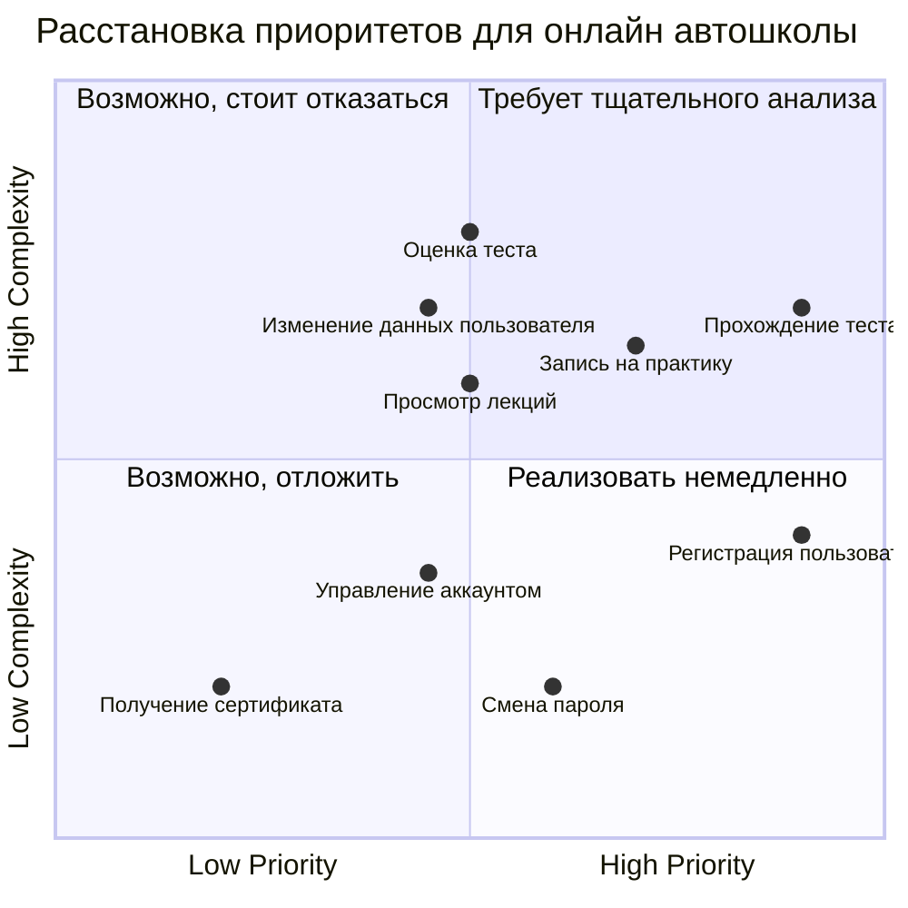

```mermaid
quadrantChart
    title Расстановка приоритетов для онлайн автошколы
    x-axis Low Priority --> High Priority
    y-axis Low Complexity --> High Complexity
    quadrant-1 "Требует тщательного анализа"
    quadrant-2 "Возможно, стоит отказаться"
    quadrant-3 "Возможно, отложить"
    quadrant-4 "Реализовать немедленно"

    "Регистрация пользователя": [0.9, 0.4]
    "Прохождение теста": [0.9, 0.7]
    "Просмотр лекций": [0.5, 0.6]
    "Запись на практику": [0.7, 0.65]
    "Управление аккаунтом": [0.45, 0.35]
    "Получение сертификата": [0.2, 0.2]
    "Смена пароля": [0.6, 0.2]
    "Изменение данных пользователя": [0.45, 0.7]
    "Оценка теста": [0.5, 0.8]
```
