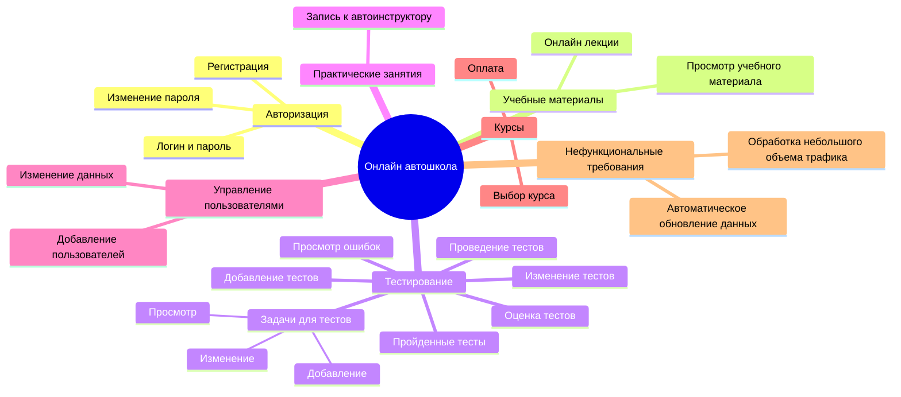
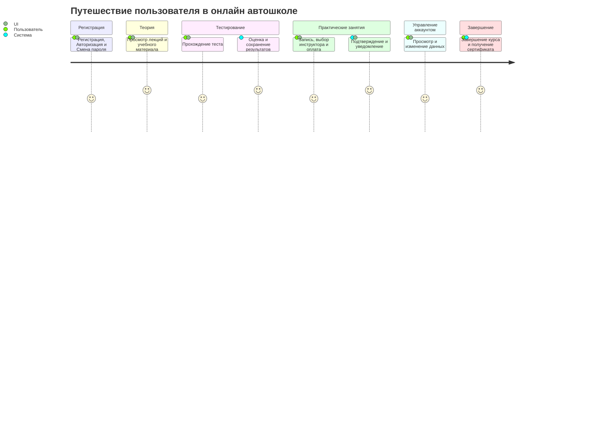
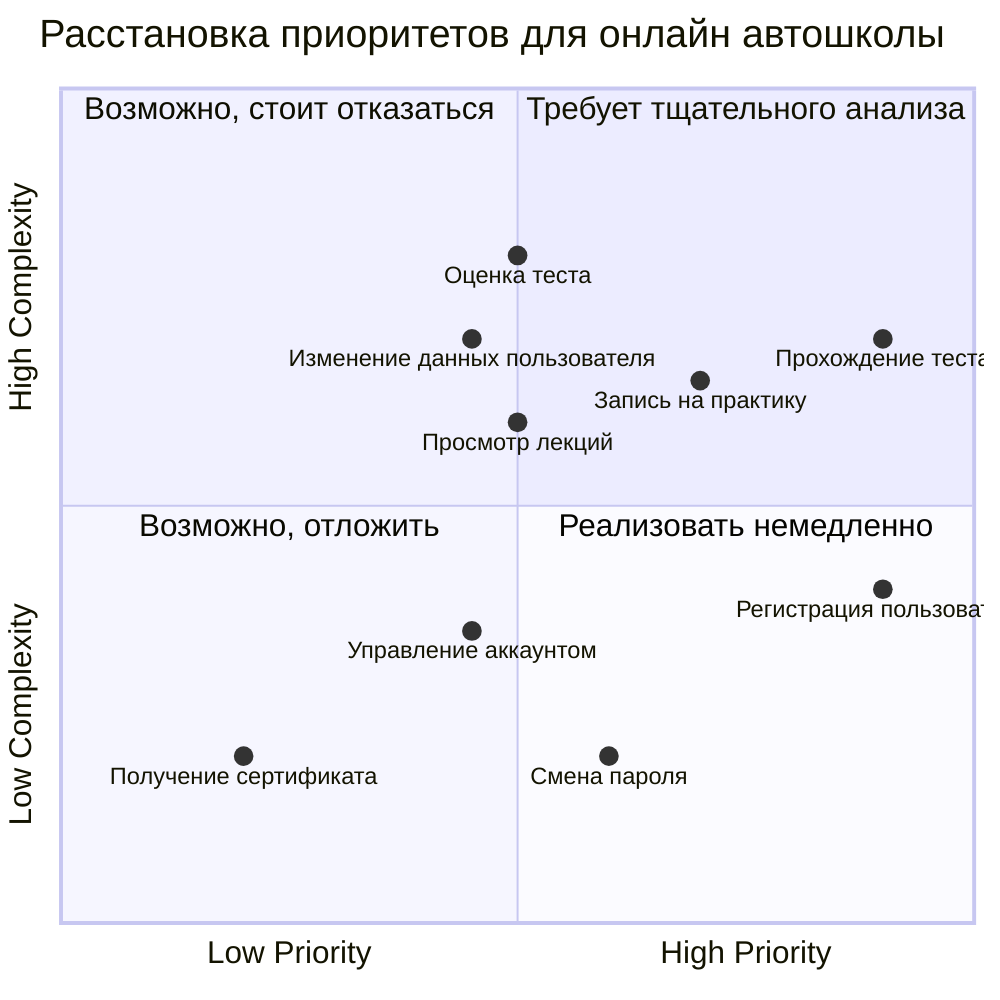
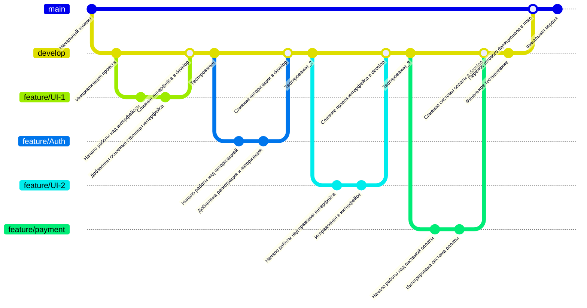

```mermaid
mindmap
  root((Онлайн автошкола))
    Авторизация
      Логин и пароль
      Изменение пароля
      Регистрация
    Учебные материалы
      Онлайн лекции
      Просмотр учебного материала
    Тестирование
      Проведение тестов
      Оценка тестов
      Пройденные тесты
      Просмотр ошибок
      Добавление тестов
      Изменение тестов
      Задачи для тестов
        Добавление
        Изменение
        Просмотр
    Практические занятия
      Запись к автоинструктору
    Управление пользователями
      Добавление пользователей
      Изменение данных
    Курсы
      Выбор курса
      Оплата
    Нефункциональные требования
      Автоматическое обновление данных
      Обработка небольшого объема трафика

```

```mermaid
journey
  title Путешествие пользователя в онлайн автошколе
  section Регистрация
    Регистрация, Авторизация и Смена пароля: 4: Пользователь, UI
  section Теория
    Просмотр лекций и учебного материала: 5: Пользователь, UI
  section Тестирование
    Прохождение теста: 4: Пользователь, UI
    Оценка и сохранение результатов: 5: Система
  section Практические занятия
    Запись, выбор инструктора и оплата: 4: Пользователь, UI
    Подтверждение и уведомление: 5: Система, UI
  section Управление аккаунтом
    Просмотр и изменение данных: 4: Пользователь, UI
  section Завершение
    Завершение курса и получение сертификата: 5: Пользователь, Система
```

```mermaid
quadrantChart
    title Расстановка приоритетов для онлайн автошколы
    x-axis Low Priority --> High Priority
    y-axis Low Complexity --> High Complexity
    quadrant-1 "Требует тщательного анализа"
    quadrant-2 "Возможно, стоит отказаться"
    quadrant-3 "Возможно, отложить"
    quadrant-4 "Реализовать немедленно"

    "Регистрация пользователя": [0.9, 0.4]
    "Прохождение теста": [0.9, 0.7]
    "Просмотр лекций": [0.5, 0.6]
    "Запись на практику": [0.7, 0.65]
    "Управление аккаунтом": [0.45, 0.35]
    "Получение сертификата": [0.2, 0.2]
    "Смена пароля": [0.6, 0.2]
    "Изменение данных пользователя": [0.45, 0.7]
    "Оценка теста": [0.5, 0.8]
```

```mermaid
gitGraph
    commit id: "Начальный коммит"
    branch develop
    commit id: "Инициализация проекта"
    branch feature/UI-1
    commit id: "Начало работы над интерфейсом"
    commit id: "Добавлены основные страницы интерфейса"
    checkout develop
    merge feature/UI-1 id: "Слияние интерфейса в develop"
    commit id: "Тестирование"
    branch feature/Auth
    commit id: "Начало работы над авторизацией"
    commit id: "Добавлена регистрация и авторизация"
    checkout develop
    merge feature/Auth id: "Слияние авторизации в develop"
    commit id: "Тестирование_2"
    branch feature/UI-2
    commit id: "Начало работы над правками интерфейса"
    commit id: "Исправления в интерфейсе"
    checkout develop
    merge feature/UI-2 id: "Слияние правок интерфейса в develop"
    commit id: "Тестирование_3"
    branch feature/payment
    commit id: "Начало работы над системой оплаты"
    commit id: "Интегрирована система оплаты"
    checkout develop
    merge feature/payment id: "Слияние системы оплаты в develop"
    commit id: "Финальное тестирование"
    checkout main
    merge develop id: "Перенос готового функционала в main"
    commit id: "Финальная версия"
```
