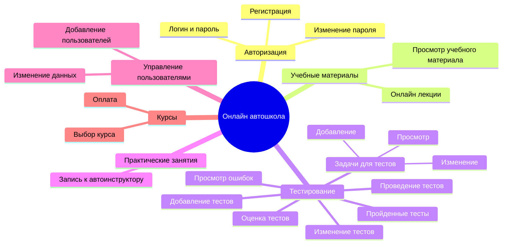
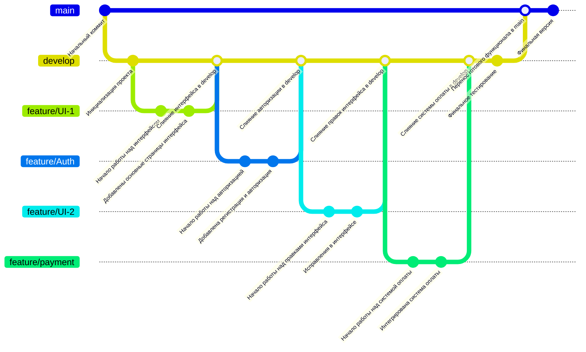

##Mermaid
Реализуем MindMap диаграмму для системы онлайн автошколы. На ней будут указаны все функциональные возможности системы.

Реализуем путешествие пользователя. Данная диаграмма показывает, как пользователь может взаимодействовать с системой и какие этапы происходят.

Разработаем диаграмму квадрантов. Она позволит понять приоритетность выполнения задач, а также то, насколько они сложные. Позволит расставить приоритеты в разработке.

Стоит заметить, что в квадранте "Возможно, стоит отказаться" совершенно не обязательно отказываться от разработки. Здесь лишь важно понимать, что данная задача менее приоритетна, но довольно трудна в разработке.

Реализуем GitGraph диаграмму для понимания того, как должен будет идти процесс разработки.

Предполагается, что в main будет лежать только готовая версия проекта. Если нужно будет ее доработать, то снова стоит обратиться к ветке development и оттуда уже к нужным элементам разработки или к новым. Предполагается, что перед слиянием веток всгда происходит тестирование. Финальное тестирование выделено отдельно и направлено на то, чтобы выявить и устранить ошибки предфинальной версии.
